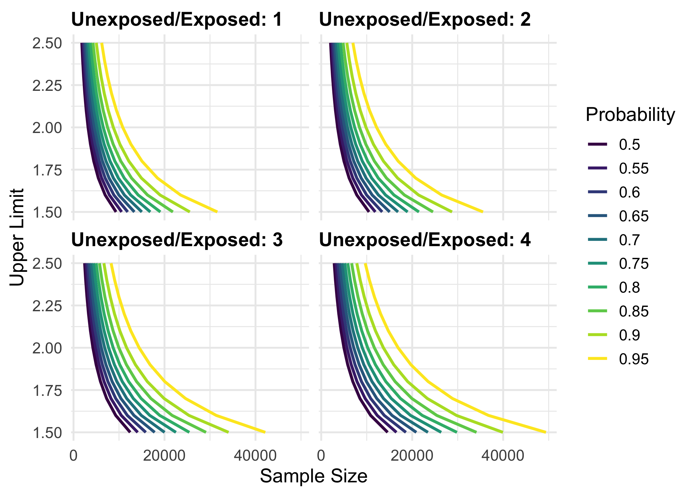

<!-- README.md is generated from README.Rmd. Please edit that file -->

<!-- badges: start -->

[](https://travis-ci.org/malcolmbarrett/precisely)
[](https://ci.appveyor.com/project/malcolmbarrett/precisely)
[](https://codecov.io/gh/malcolmbarrett/precisely?branch=master)
[](https://CRAN.R-project.org/package=precisely)
[](https://www.tidyverse.org/lifecycle/#maturing)
<!-- badges: end -->

# precisely: An R package for estimating sample size based on precision

precisely is a study planning tool to calculate sample size based on
precision rather than power. Power calculations are focused on whether
or not an estimate will be statistically significant; calculations of
precision are based on the same principles as power calculation but turn
the focus to the width of the confidence interval.

This package includes a Shiny app to help with calculations, which you
can start with `launch_precisely_app()`. You can also find a live
version at
[malcolmbarrett.shinyapps.io/precisely](https://malcolmbarrett.shinyapps.io/precisely/).

For more, see the
[vignette](http://precisely.malco.io/articles/introduction-to-precisely.html).

These tools are based on the work of [Rothman and
Greenland](https://www.ncbi.nlm.nih.gov/pubmed/29912015).

## Installation

You precisely from CRAN with:

``` r
install.packages("precisely")
```

You can install the development version of precisely with:

``` r
# install.packages("devtools")
devtools::install_github("malcolmbarrett/precisely")
```

## Example

precisely has functions for studies using risk differences, risk ratios,
rate differences, rate ratios, and odds ratios. The heart of these
calculations is the desired precision. For ratio measures, this is the
ratio of the upper to lower limit of the confidence interval. For
difference measures, this is the absolute width of the confidence
interval. To calculate sample size for a given precision, you also need
proportions for the two groups (the risk or rate in the exposed and
unexposed participants in a cohort study or the exposure prevalence in
the cases and controls in case-control studies), the ratios of the two
groups (the unexposed to the exposed in cohort studies or controls to
cases in case-control studies), and the desired confidence interval
probability. The default is 95%.

Let’s say we want to calculate the sample size needed to estimate a 90%
CI for a risk difference of .1 with an absolute width of .08. Here, the
risk among the exposed is .4, the risk among the unexposed is .3, and
there are three times as many unexposed participants.

``` r
library(precisely)

n_risk_difference(
  precision = .08,
  exposed = .4,
  unexposed = .3,
  group_ratio = 3,
  ci = .90
)
#> # A tibble: 1 x 9
#>   n_exposed n_unexposed n_total risk_difference precision exposed unexposed
#>       <dbl>       <dbl>   <dbl>           <dbl>     <dbl>   <dbl>     <dbl>
#> 1      524.       1573.   2097.             0.1      0.08     0.4       0.3
#> # … with 2 more variables: group_ratio <dbl>, ci <dbl>
```

precisely also provides functionality to calculate the precision of an
estimate given a sample size and to calculate sample size based on
probability that the upper limit of the confidence interval is below a
level of concern.

To calculate several values and plot them, use `map_precisely()` and the
included `plot_*()` functions.

``` r
library(tidyverse)

map_precisely(
  upper_rate_ratio, 
  upper_limit = seq(1.5, 2.5, by = .1),
  prob = seq(.50, .95, by = .05),
  exposed = .01,
  unexposed = .01,
  group_ratio = 1:4
 ) %>% 
  group_by("Probability" = factor(prob)) %>% 
  plot_upper_limit(line_size = 1) +
    scale_color_viridis_d() +
    scale_x_continuous(breaks = scales::pretty_breaks(3)) + 
    theme_precisely() +
    theme(legend.position = "right") + 
    facet_wrap(~ group_ratio,
               labeller = as_labeller(function(x) paste("Unexposed/Exposed:", x)))
```



## Code of Conduct

Please note that the precisely project is released with a [Contributor
Code of
Conduct](https://contributor-covenant.org/version/2/0/CODE_OF_CONDUCT.html).
By contributing to this project, you agree to abide by its terms.
